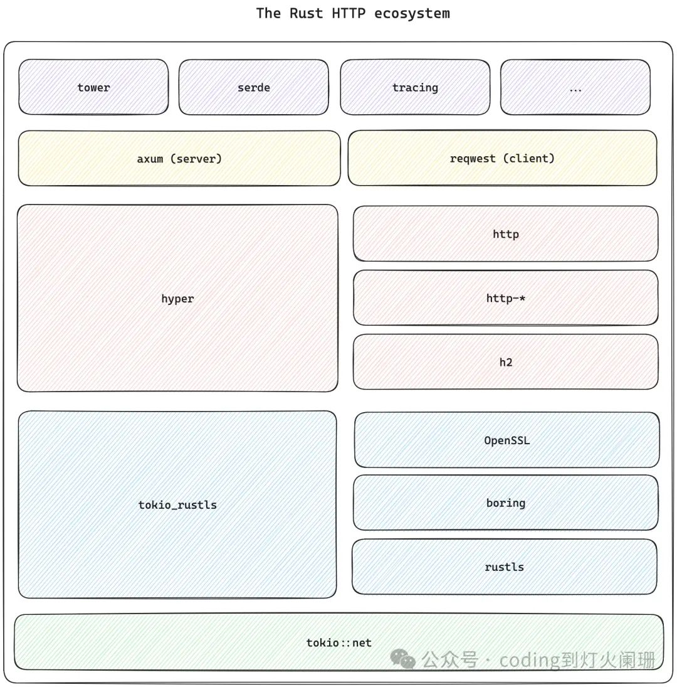

# Actix-web vs Axum

Rust HTTP框架有两个主要框架：acitx-web和axum。

两者之间的主要区别在于，actix-web实现了自己的HTTP技术栈，由于现代HTTP技术栈的疯狂复杂性，这带来了一些风险，而axum是对HTTP技术栈的人体工程学包装，这被许多人认为是最可靠和性能最好的HTTP技术栈。

axum是由Tokio团队维护的，并且是hyper的包装器，所以我认为它是更安全的选择。


# Rust HTTP的不同层

既然我们已经选择了axum web框架，那么让我们深入探讨这个主题的核心：运行HTTP服务器所需的许多不同的crate是如何组合在一起的。




在技术栈的底部，你可以找到异步运行时：Tokio。运行时负责调度不同的任务，并提供操作系统套接字API的异步版本。在这里，Tokio监听并接受新的TCP连接。

然后是TLS层，负责保护发送和接收的数据流。这一层实际上由两部分组成：tokio_*(如tokio_rustls或tokio_boring)和一些实现TLS协议的库。

有几个crate可以用来处理TLS协议：rustls、boring和OpenSSL。建议使用rustls，因为它是一个rust原生库，它是静态链接到你的可执行文件，当部署你的服务器(服务器的VM/Docker镜像是否包含正确版本的OpenSSL…)或当试图交叉编译你的程序时，你会遇到更少的问题。

tokio_rustls将tokio类型和rustls类型打包到一个统一的层中。具体来说，它将Tokio的TcpStream转换为处理数据加密和解密的TlsStream。每个TLS库都有其等效的tokio_*，例如tokio_boring。

一旦有了TLS流之后，需要将其传送到hyper中。Hyper是整个团队的大脑。它将来自网络的字节转换为请求和响应结构。Hyper与传输无关，它只是将字节流转换为结构化的请求和响应。

TLS代码示例：

```rust
let server_tls_config = rustls::ServerConfig::builder(); // ...
let tls_acceptor = tokio_rustls::TlsAcceptor::from(Arc::new(server_tls_config));

let listener = tokio::net::TcpListener::bind(SocketAddr::from(([127, 0, 0, 1], 8080))).await?;

loop {
    let (stream, remote_socket_addr) = listener.accept().await?;
    let tls_acceptor = tls_acceptor.clone();

    let request_handler = hyper::service::service_fn(move |mut req| {
        let remote_socket_addr = remote_socket_addr.to_string();
        req.extensions_mut().insert(socket_addr_str);
        actual_handler(req)
    });

    tokio::spawn(async move {
        let tls_stream = tls_acceptor.accept(stream).await.unwrap(); // need to handle error
        if let Err(err) = hyper_util::server::conn::auto::Builder::new(TokioExecutor::new())
            .serve_connection_with_upgrades(TokioIo::new(tls_stream), request_handler)
            .await
        {
            error!("failed to serve connection: {err:#}");
        }
    })
}
```
为此，它依赖于“编解码器”来解码来自网络的实际字节，这取决于HTTP协议的不同版本：HTTP对应HTTP/1.X，h2用于HTTP/2.X等等。

在hyper之上，有axum，人体工程学层提供了程序员在开发web服务器时所期望的实用工具：路由、中间件、错误处理，“提取器”等等。

在客户端，reqwest相当于axum，并提供连接池、代理处理、主机名解析等功能。

然后还有无数的crate，比如tower，它试图通过其服务和层特性为Rust HTTP生态系统带来统一的处理程序和中间件。
